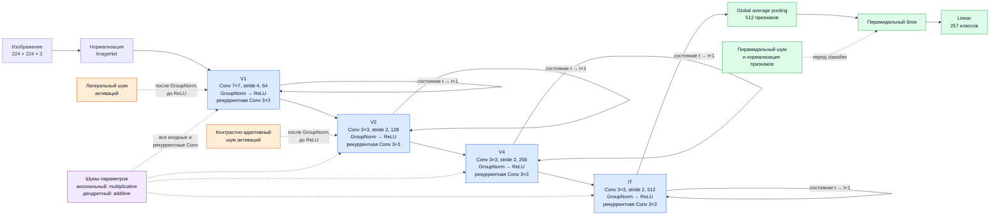

# Человекоподобные шумы в CORnet-RT и устойчивость к атакам

## Цель исследования

Цель эксперимента — проверить, переносится ли эффект человекоподобных шумов с небольшой сверточной сети на более сложную модель зрительного восприятия и датасет с изображениями высокого разрешения. Проверялось, могут ли шумы активаций и параметров повысить устойчивость к FGSM и PGD без существенного ухудшения качества на чистых изображениях.

В качестве модели использовалась CORnet-RT, а в качестве датасета — Caltech-256. Для каждого варианта обучение повторялось с тремя seed. Устойчивость оценивалась двумя способами:

1. **White-box:** атака строилась непосредственно против проверяемой модели.
2. **Baseline-transfer:** атака строилась против исходной модели без шумов, после чего те же атакованные изображения подавались всем шумовым моделям.

## Датасет Caltech-256

Использовался датасет `ilee0022/Caltech-256`:

- 257 классов с учетом фонового класса;
- 24 791 изображение в train split;
- 2 755 изображений в validation split;
- 3 061 изображение в test split;
- входное разрешение модели — `224 × 224`.

При обучении применялись `RandomResizedCrop(224)` и случайное горизонтальное отражение. Для validation и test использовались `Resize(256)` и `CenterCrop(224)`. Validation применялся только для выбора лучшего checkpoint, а итоговые clean- и adversarial-метрики вычислялись на test.

## Модель CORnet-RT

CORnet-RT — рекуррентная сверточная модель, структура которой приближенно соответствует последовательным областям вентрального зрительного пути:

```text
Изображение → V1 → V2 → V4 → IT → global average pooling → classifier
```

Число каналов последовательно увеличивается от 64 в V1 до 512 в IT. Каждый блок содержит входную свертку, GroupNorm, ReLU и рекуррентную свертку. Обработка повторяется пять временных шагов. После IT выполняются глобальное усреднение и линейная классификация на 257 классов.

Перед дообучением загружались веса CORnet-RT, предварительно обученные на ImageNet. Исходный классификатор на 1000 классов заменялся новым слоем на 257 классов. Нормализация ImageNet включена внутрь модели, поэтому атаки работают с изображениями в диапазоне `[0, 1]`.

### Архитектура и расположение шумов



Сплошные стрелки показывают основной поток признаков. Петли внутри V1, V2, V4 и IT обозначают рекуррентное состояние, которое обновляется на пяти временных шагах. Пунктирные стрелки показывают места воздействия шумов. В baseline все шумы отключены, а пирамидальный блок работает как `Identity`.

## Человекоподобные шумы

Использованные механизмы являются вычислительными аналогиями биологических процессов, а не точными биофизическими моделями.

### Латеральное торможение

Латеральный шум добавлялся в раннюю зрительную область V1 после входной свертки и GroupNorm, перед ReLU. Белый шум пропускался через дискретный лапласиан:

```text
 0  -1   0
-1   4  -1
 0  -1   0
```

После нормировки пространственно структурированное возмущение добавлялось к активациям:

```text
y = x + sigma_lateral · L(epsilon) / std(L(epsilon))
```

Такой шум имитирует локальное взаимодействие соседних нейронов. В отдельном эксперименте использовалось `sigma_lateral = 0.05`.

### Контрастно-адаптивный шум

Контрастно-адаптивный шум добавлялся в V2 после входной свертки и GroupNorm, перед ReLU. Его дисперсия зависела от величины активации:

```text
variance = (sigma_prop · |x|)^2 + sigma_add^2
y = x + epsilon · sqrt(variance)
```

При сильном сигнале возрастает пропорциональная составляющая шума, а `sigma_add` задает минимальный аддитивный уровень. Использовались `sigma_prop = 0.10` и `sigma_add = 0.01`.

### Пирамидальный шум

Пирамидальный блок располагался после global average pooling и перед линейным классификатором. Сначала признаки проходили нелинейное преобразование с нормализацией по каналам:

```text
signal = |x|^gamma
y = sign(x) · signal / (b + mean(signal))
```

Во время обучения добавлялась случайная составляющая с `sigma_pyramid = 0.02`. Использовались `gamma = 1` и `b = 1`. На инференсе случайная часть отключалась, но детерминированное пирамидальное преобразование сохранялось. В baseline пирамидальный блок был полностью отключен.

### Аксональный шум параметров

Аксональный шум реализован как мультипликативное возмущение весов сверток:

```text
W_noisy = W · (1 + sigma_axon · epsilon)
```

Это упрощенная модель вариативности передачи сигнала по аксону. Шум применялся ко входным и рекуррентным сверткам всех областей V1, V2, V4 и IT. Использовалось `sigma_axon = 0.02`.

### Дендритный шум параметров

Дендритный шум реализован как аддитивное возмущение весов, масштабированное стандартным отклонением параметров текущего слоя:

```text
W_noisy = W + sigma_dendrite · std(W) · epsilon
```

Это упрощенная модель вариативности дендритной интеграции входящих сигналов. Шум применялся к тем же сверткам V1, V2, V4 и IT. Использовалось `sigma_dendrite = 0.02`.

Аксональный и дендритный шумы не применялись к последнему линейному классификатору. Все случайные шумы активаций и параметров были активны только во время обучения. На инференсе модели были детерминированными.

## Конфигурации экспериментов

| Конфигурация | Lateral | Contrast prop/add | Pyramidal | Axon | Dendrite |
|---|---:|---:|---:|---:|---:|
| `baseline` | 0 | 0 / 0 | выключен | 0 | 0 |
| `lateral_005` | 0.05 | 0 / 0 | выключен | 0 | 0 |
| `contrast_p010_a001` | 0 | 0.10 / 0.01 | выключен | 0 | 0 |
| `pyramidal_002` | 0 | 0 / 0 | 0.02 | 0 | 0 |
| `axon_002` | 0 | 0 / 0 | выключен | 0.02 | 0 |
| `dendrite_002` | 0 | 0 / 0 | выключен | 0 | 0.02 |
| `combined_low` | 0.03 | 0.05 / 0.005 | 0.01 | 0.01 | 0.01 |

Каждая конфигурация обучалась с seed 42, 43 и 44. Всего выполнен 21 запуск.

## Обучение

Обучение состояло из двух этапов:

1. Первые 10 эпох обучался только новый классификатор с learning rate `0.001`.
2. Следующие 40 эпох обучалась вся CORnet-RT с learning rate `0.0001`.

Использовались AdamW, weight decay `0.0001`, cosine learning-rate scheduler и batch size 32. Шумы были активны на обоих этапах: сначала классификатор обучался на зашумленных признаках замороженной CORnet, затем вся сеть адаптировалась к шумам.

Во время полного дообучения train accuracy приближалась к 100%, тогда как validation accuracy оставалась около 74–75%. Это указывает на переобучение. Тем не менее после завершения обучения для итогового тестирования восстанавливался checkpoint с максимальной validation accuracy, а не параметры последней эпохи.

## Состязательные атаки

Использовались нецелевые атаки в норме L-infinity:

- FGSM: один градиентный шаг, `epsilon = 8/255`;
- PGD: случайная инициализация внутри epsilon-окрестности, 10 шагов с `alpha = 2/255`, `epsilon = 8/255`;
- после каждого изменения изображение ограничивалось диапазоном `[0, 1]`.

### White-box проверка

FGSM и PGD строились непосредственно по градиентам каждой проверяемой модели. Такой сценарий показывает устойчивость против атакующего, знающего архитектуру и параметры защиты.

### Перенос атак от baseline

Для каждого seed атаки строились по градиентам соответствующей baseline-модели. Полученный adversarial batch без изменений подавался baseline и всем шести шумовым моделям того же seed. Атакованные изображения создавались один раз для каждого batch и не пересчитывались под шумовые модели. Это воспроизводит исходную постановку с переносом атакованного датасета от базовой модели.

## Результаты

Исходные данные анализа находятся в [`results.csv`](../results/results.csv), [`summary.csv`](../results/summary.csv) и transfer-таблицах для [seed 42](../results/transfer_seed_42.csv), [seed 43](../results/transfer_seed_43.csv) и [seed 44](../results/transfer_seed_44.csv).

В таблице приведены среднее и стандартное отклонение accuracy по трем seed. Изменение transfer FGSM рассчитано относительно baseline того же seed, после чего усреднено.

| Модель | Clean, % | White-box FGSM, % | FGSM от baseline, % | Изменение transfer FGSM, п.п. |
|---|---:|---:|---:|---:|
| Baseline | 74.37 ± 0.13 | 2.30 ± 0.05 | 2.30 ± 0.05 | — |
| Латеральный шум | 74.21 ± 0.28 | 2.24 ± 0.22 | 2.64 ± 0.04 | +0.34 |
| Контрастно-адаптивный шум | 74.54 ± 0.15 | 2.22 ± 0.17 | 2.52 ± 0.10 | +0.22 |
| Пирамидальный шум | 74.25 ± 0.24 | 2.30 ± 0.21 | 2.69 ± 0.19 | +0.39 |
| Аксональный шум | 74.29 ± 0.07 | 2.29 ± 0.12 | 2.37 ± 0.05 | +0.08 |
| Дендритный шум | 74.55 ± 0.25 | 2.29 ± 0.09 | 2.44 ± 0.12 | +0.14 |
| Комбинация шумов | 74.30 ± 0.27 | 1.96 ± 0.12 | 2.67 ± 0.54 | +0.37 |

Для PGD accuracy всех моделей равна `0.00%` как при white-box проверке, так и при переносе атаки от baseline.

### Качество на чистых данных

Все варианты показали близкую clean accuracy: от 74.21% до 74.55%. Шумы не вызвали существенного общего падения качества, но и не дали убедительного улучшения. Наибольшее среднее значение получила модель с дендритным шумом — 74.55%, что выше baseline только на 0.19 процентного пункта. Контрастно-адаптивный шум дал 74.54%. Эти различия малы относительно масштаба эксперимента и трех повторений.

### White-box устойчивость

Ни один шум не улучшил среднюю white-box FGSM accuracy относительно baseline. Результаты отдельных шумов находятся около 2.2–2.3%, а комбинация снизила accuracy до 1.96%. PGD полностью разрушила все модели.

Следовательно, шумы не сформировали устойчивую локальную границу решений. Если атакующий рассчитывает градиент непосредственно для шумовой модели, наблюдавшееся transfer-преимущество исчезает.

### Устойчивость к атакам от baseline

При переносе FGSM небольшое улучшение наблюдалось у большинства шумовых моделей:

- пирамидальный шум: `+0.39` п.п.;
- комбинация шумов: `+0.37` п.п.;
- латеральный шум: `+0.34` п.п.;
- контрастно-адаптивный шум: `+0.22` п.п.;
- дендритный шум: `+0.14` п.п.;
- аксональный шум: `+0.08` п.п.

Латеральный шум дал наиболее стабильный transfer-эффект: улучшение относительно baseline наблюдалось на всех трех seed, а стандартное отклонение составило только 0.04 п.п. Пирамидальный шум показал наибольшее среднее значение — 2.69%. Комбинация была нестабильной: на seed 42 она заметно превзошла baseline, а на seed 44 оказалась хуже.

Несмотря на положительные разницы, абсолютная accuracy осталась крайне низкой. На тестовой выборке из 3 061 изображения baseline правильно классифицировал после FGSM в среднем около 70 изображений, а лучшие варианты — около 81–82. Для 257 классов случайное угадывание соответствует примерно 0.39%, поэтому 2–3% выше случайного уровня, но модель по-прежнему ошибается в 97–98% случаев.

## Почему результат хуже предыдущего эксперимента

В предыдущем эксперименте на небольшой CNN и CIFAR-10 наблюдался более заметный прирост устойчивости. Текущее исследование не является прямым повторением только с заменой модели: одновременно изменились архитектура, датасет, разрешение и число классов. Поэтому разницу нельзя приписать одной CORnet-RT.

Основные причины более слабого эффекта:

1. **Задача стала существенно сложнее.** CIFAR-10 содержит 10 классов, а текущая постановка — 257. Даже небольшое смещение признаков теперь чаще переводит предсказание в один из множества неправильных классов.

2. **Разрешение выросло с 32 × 32 до 224 × 224.** При том же ограничении `8/255` атака может изменять намного больше пикселей. Число входных координат выросло в 49 раз, а максимально возможная L2-норма возмущения при том же L-infinity бюджете — примерно в 7 раз.

3. **На один класс приходится мало обучающих примеров.** В train split Caltech-256 в среднем около 96 изображений на класс. У CIFAR-10 — около 5 000. Это облегчает запоминание обучающей выборки и согласуется с большим разрывом между train и validation accuracy.

4. **Шумы не являются adversarial training.** Они создают случайные возмущения, не направленные на увеличение функции потерь. FGSM и PGD, напротив, используют градиент модели и выбирают наиболее неблагоприятное направление. Устойчивость к случайной вариативности не гарантирует устойчивость к целевой атаке.

5. **Уровни шумов не настраивались специально для CORnet-RT.** Использовалась одна умеренная интенсивность каждого механизма. Значения, подходящие небольшой CNN, могут оказаться слишком слабыми для 512-канальных рекуррентных признаков или мешать оптимизации отдельных блоков.

6. **Предобученные признаки уже хорошо решают clean-задачу.** Fine-tuning сохраняет представление ImageNet, но обычные предобученные веса не оптимизированы для adversarial robustness. Добавление случайного шума во время дообучения с небольшим датасетом не успевает полностью перестроить границу решений.

7. **Transfer-эффект не равен истинной устойчивости.** Шумы немного изменяют границу решений, поэтому атаки от baseline хуже переносятся. Однако white-box результаты показывают, что адаптированная к новой модели атака снова находит уязвимое направление. Поэтому небольшой transfer-прирост нельзя считать полноценной защитой.

8. **Рекуррентная обработка меняет влияние шума.** В CORnet-RT признаки проходят несколько временных шагов. Возмущение может частично подавляться нормализацией либо накапливаться в состоянии блока. Одно фиксированное значение интенсивности не обязательно одинаково подходит ранним и поздним временным шагам.

## Вывод

Человекоподобные шумы почти не изменили clean accuracy CORnet-RT и немного снизили переносимость FGSM-атак, построенных на baseline. Наиболее заметный transfer-эффект дали пирамидальный и латеральный шумы. Однако абсолютный прирост не превысил 0.39 процентного пункта, ни один вариант не улучшил white-box FGSM, а PGD снизила accuracy всех моделей до нуля.

При выбранных интенсивностях и протоколе обучения человекоподобные шумы нельзя считать самостоятельным методом защиты CORnet-RT. Эксперимент при этом дает содержательный отрицательный результат: небольшая устойчивость к переносу атаки объясняется изменением границы решений, но исчезает при атаке, адаптированной к конкретной модели.

Для дальнейшей проверки имеет смысл рассматривать латеральный и пирамидальный шумы как дополнительные регуляризаторы совместно с adversarial training, а не как отдельную защиту. Также необходим отдельный подбор интенсивности для CORnet-RT и проверка нескольких значений epsilon.
