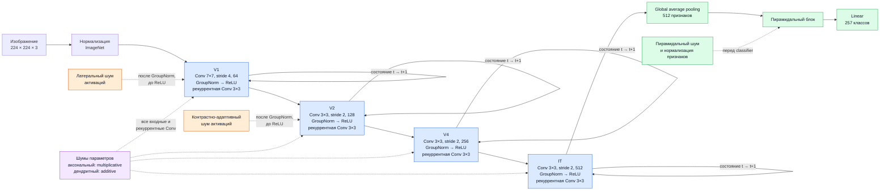

# Человекоподобные шумы в CORnet-RT и устойчивость к атакам

## Цель исследования

Цель эксперимента — проверить, переносится ли эффект человекоподобных шумов с небольшой сверточной сети на более сложную модель зрительного восприятия и датасет с изображениями высокого разрешения. Проверялось, могут ли шумы активаций и параметров повысить устойчивость к FGSM и PGD без существенного ухудшения качества на чистых изображениях.

В качестве модели использовалась CORnet-RT, а в качестве датасета — Caltech-256. Основной эксперимент с умеренными шумами повторялся с тремя seed. После него была выполнена отдельная широкая развертка уровней шума на seed 42, чтобы определить границу падения обычного качества и проверить, возникает ли до нее устойчивость к атакам. Устойчивость оценивалась двумя способами:

1. **White-box:** атака строилась непосредственно против проверяемой модели.
2. **Baseline-transfer:** атака строилась против исходной модели без шумов, после чего те же атакованные изображения подавались всем шумовым моделям.

## Датасет Caltech-256

Использовался датасет `ilee0022/Caltech-256`:

- 257 классов с учетом фонового класса;
- 24 791 изображение в train split;
- 2 755 изображений в validation split;
- 3 061 изображение в test split;
- входное разрешение модели — `224 × 224`.

При обучении применялись `RandomResizedCrop(224)` и случайное горизонтальное отражение. Для validation и test использовались `Resize(256)` и `CenterCrop(224)`. Validation применялся только для выбора лучшего checkpoint, а итоговые clean- и adversarial-метрики вычислялись на test.

## Модель CORnet-RT

CORnet-RT — рекуррентная сверточная модель, структура которой приближенно соответствует последовательным областям вентрального зрительного пути:

```text
Изображение → V1 → V2 → V4 → IT → global average pooling → classifier
```

Число каналов последовательно увеличивается от 64 в V1 до 512 в IT. Каждый блок содержит входную свертку, GroupNorm, ReLU и рекуррентную свертку. Обработка повторяется пять временных шагов. После IT выполняются глобальное усреднение и линейная классификация на 257 классов.

Перед дообучением загружались веса CORnet-RT, предварительно обученные на ImageNet. Исходный классификатор на 1000 классов заменялся новым слоем на 257 классов. Нормализация ImageNet включена внутрь модели, поэтому атаки работают с изображениями в диапазоне `[0, 1]`.

### Архитектура и расположение шумов


```mermaid
flowchart LR
    INPUT["Изображение<br/>224 × 224 × 3"] --> NORM["Нормализация<br/>ImageNet"]
    NORM --> V1["V1<br/>Conv 7×7, stride 4, 64<br/>GroupNorm → ReLU<br/>рекуррентная Conv 3×3"]
    V1 --> V2["V2<br/>Conv 3×3, stride 2, 128<br/>GroupNorm → ReLU<br/>рекуррентная Conv 3×3"]
    V2 --> V4["V4<br/>Conv 3×3, stride 2, 256<br/>GroupNorm → ReLU<br/>рекуррентная Conv 3×3"]
    V4 --> IT["IT<br/>Conv 3×3, stride 2, 512<br/>GroupNorm → ReLU<br/>рекуррентная Conv 3×3"]
    IT --> POOL["Global average pooling<br/>512 признаков"]
    POOL --> PYR["Пирамидальный блок"]
    PYR --> FC["Linear<br/>257 классов"]

    LAT["Латеральный шум<br/>активаций"] -. "после GroupNorm,<br/>до ReLU" .-> V1
    CONTRAST["Контрастно-адаптивный<br/>шум активаций"] -. "после GroupNorm,<br/>до ReLU" .-> V2
    PNOISE["Пирамидальный шум<br/>и нормализация признаков"] -. "перед classifier" .-> PYR
    PARAM["Шумы параметров<br/>аксональный: multiplicative<br/>дендритный: additive"] -. "все входные и<br/>рекуррентные Conv" .-> V1
    PARAM -.-> V2
    PARAM -.-> V4
    PARAM -.-> IT

    V1 -- "состояние t → t+1" --> V1
    V2 -- "состояние t → t+1" --> V2
    V4 -- "состояние t → t+1" --> V4
    IT -- "состояние t → t+1" --> IT

    classDef area fill:#dbeafe,stroke:#2563eb,color:#111827;
    classDef activation fill:#ffedd5,stroke:#ea580c,color:#111827;
    classDef parameter fill:#f3e8ff,stroke:#9333ea,color:#111827;
    classDef head fill:#dcfce7,stroke:#16a34a,color:#111827;
    class V1,V2,V4,IT area;
    class LAT,CONTRAST activation;
    class PARAM parameter;
    class POOL,PYR,PNOISE,FC head;
```

Сплошные стрелки показывают основной поток признаков. Петли внутри V1, V2, V4 и IT обозначают рекуррентное состояние, которое обновляется на пяти временных шагах. Пунктирные стрелки показывают места воздействия шумов. В baseline все шумы отключены, а пирамидальный блок работает как `Identity`.

## Человекоподобные шумы

Использованные механизмы являются вычислительными аналогиями биологических процессов, а не точными биофизическими моделями.

### Латеральное торможение

Латеральный шум добавлялся в раннюю зрительную область V1 после входной свертки и GroupNorm, перед ReLU. Белый шум пропускался через дискретный лапласиан:

```text
 0  -1   0
-1   4  -1
 0  -1   0
```

После нормировки пространственно структурированное возмущение добавлялось к активациям:

```text
y = x + sigma_lateral · L(epsilon) / std(L(epsilon))
```

Такой шум имитирует локальное взаимодействие соседних нейронов. В отдельном эксперименте использовалось `sigma_lateral = 0.05`.

### Контрастно-адаптивный шум

Контрастно-адаптивный шум добавлялся в V2 после входной свертки и GroupNorm, перед ReLU. Его дисперсия зависела от величины активации:

```text
variance = (sigma_prop · |x|)^2 + sigma_add^2
y = x + epsilon · sqrt(variance)
```

При сильном сигнале возрастает пропорциональная составляющая шума, а `sigma_add` задает минимальный аддитивный уровень. Использовались `sigma_prop = 0.10` и `sigma_add = 0.01`.

### Пирамидальный шум

Пирамидальный блок располагался после global average pooling и перед линейным классификатором. Сначала признаки проходили нелинейное преобразование с нормализацией по каналам:

```text
signal = |x|^gamma
y = sign(x) · signal / (b + mean(signal))
```

Во время обучения добавлялась случайная составляющая с `sigma_pyramid = 0.02`. Использовались `gamma = 1` и `b = 1`. На инференсе случайная часть отключалась, но детерминированное пирамидальное преобразование сохранялось. В baseline пирамидальный блок был полностью отключен.

### Аксональный шум параметров

Аксональный шум реализован как мультипликативное возмущение весов сверток:

```text
W_noisy = W · (1 + sigma_axon · epsilon)
```

Это упрощенная модель вариативности передачи сигнала по аксону. Шум применялся ко входным и рекуррентным сверткам всех областей V1, V2, V4 и IT. Использовалось `sigma_axon = 0.02`.

### Дендритный шум параметров

Дендритный шум реализован как аддитивное возмущение весов, масштабированное стандартным отклонением параметров текущего слоя:

```text
W_noisy = W + sigma_dendrite · std(W) · epsilon
```

Это упрощенная модель вариативности дендритной интеграции входящих сигналов. Шум применялся к тем же сверткам V1, V2, V4 и IT. Использовалось `sigma_dendrite = 0.02`.

Аксональный и дендритный шумы не применялись к последнему линейному классификатору. Все случайные шумы активаций и параметров были активны только во время обучения. На инференсе модели были детерминированными.

## Конфигурации экспериментов

| Конфигурация | Lateral | Contrast prop/add | Pyramidal | Axon | Dendrite |
|---|---:|---:|---:|---:|---:|
| `baseline` | 0 | 0 / 0 | выключен | 0 | 0 |
| `lateral_005` | 0.05 | 0 / 0 | выключен | 0 | 0 |
| `contrast_p010_a001` | 0 | 0.10 / 0.01 | выключен | 0 | 0 |
| `pyramidal_002` | 0 | 0 / 0 | 0.02 | 0 | 0 |
| `axon_002` | 0 | 0 / 0 | выключен | 0.02 | 0 |
| `dendrite_002` | 0 | 0 / 0 | выключен | 0 | 0.02 |
| `combined_low` | 0.03 | 0.05 / 0.005 | 0.01 | 0.01 | 0.01 |

Каждая конфигурация обучалась с seed 42, 43 и 44. Всего выполнен 21 запуск.

## Обучение

Обучение состояло из двух этапов:

1. Первые 10 эпох обучался только новый классификатор с learning rate `0.001`.
2. Следующие 40 эпох обучалась вся CORnet-RT с learning rate `0.0001`.

Использовались AdamW, weight decay `0.0001`, cosine learning-rate scheduler и batch size 32. Шумы были активны на обоих этапах: сначала классификатор обучался на зашумленных признаках замороженной CORnet, затем вся сеть адаптировалась к шумам.

Во время полного дообучения train accuracy приближалась к 100%, тогда как validation accuracy оставалась около 74–75%. Это указывает на переобучение. Тем не менее после завершения обучения для итогового тестирования восстанавливался checkpoint с максимальной validation accuracy, а не параметры последней эпохи.

## Состязательные атаки

Использовались нецелевые атаки в норме L-infinity:

- FGSM: один градиентный шаг, `epsilon = 8/255`;
- PGD: случайная инициализация внутри epsilon-окрестности, 10 шагов с `alpha = 2/255`, `epsilon = 8/255`;
- после каждого изменения изображение ограничивалось диапазоном `[0, 1]`.

### White-box проверка

FGSM и PGD строились непосредственно по градиентам каждой проверяемой модели. Такой сценарий показывает устойчивость против атакующего, знающего архитектуру и параметры защиты.

### Перенос атак от baseline

Для каждого seed атаки строились по градиентам соответствующей baseline-модели. Полученный adversarial batch без изменений подавался baseline и всем шести шумовым моделям того же seed. Атакованные изображения создавались один раз для каждого batch и не пересчитывались под шумовые модели. Это воспроизводит исходную постановку с переносом атакованного датасета от базовой модели.

## Результаты

Исходные данные анализа находятся в [`results.csv`](results/results.csv), [`summary.csv`](results/summary.csv) и transfer-таблицах для [seed 42](results/transfer_seed_42.csv), [seed 43](results/transfer_seed_43.csv) и [seed 44](results/transfer_seed_44.csv).

В таблице приведены среднее и стандартное отклонение accuracy по трем seed. Изменение transfer FGSM рассчитано относительно baseline того же seed, после чего усреднено.

| Модель | Clean, % | White-box FGSM, % | FGSM от baseline, % | Изменение transfer FGSM, п.п. |
|---|---:|---:|---:|---:|
| Baseline | 74.37 ± 0.13 | 2.30 ± 0.05 | 2.30 ± 0.05 | — |
| Латеральный шум | 74.21 ± 0.28 | 2.24 ± 0.22 | 2.64 ± 0.04 | +0.34 |
| Контрастно-адаптивный шум | 74.54 ± 0.15 | 2.22 ± 0.17 | 2.52 ± 0.10 | +0.22 |
| Пирамидальный шум | 74.25 ± 0.24 | 2.30 ± 0.21 | 2.69 ± 0.19 | +0.39 |
| Аксональный шум | 74.29 ± 0.07 | 2.29 ± 0.12 | 2.37 ± 0.05 | +0.08 |
| Дендритный шум | 74.55 ± 0.25 | 2.29 ± 0.09 | 2.44 ± 0.12 | +0.14 |
| Комбинация шумов | 74.30 ± 0.27 | 1.96 ± 0.12 | 2.67 ± 0.54 | +0.37 |

Для PGD accuracy всех моделей равна `0.00%` как при white-box проверке, так и при переносе атаки от baseline.

### Качество на чистых данных

Все варианты показали близкую clean accuracy: от 74.21% до 74.55%. Шумы не вызвали существенного общего падения качества, но и не дали убедительного улучшения. Наибольшее среднее значение получила модель с дендритным шумом — 74.55%, что выше baseline только на 0.19 процентного пункта. Контрастно-адаптивный шум дал 74.54%. Эти различия малы относительно масштаба эксперимента и трех повторений.

### White-box устойчивость

Ни один шум не улучшил среднюю white-box FGSM accuracy относительно baseline. Результаты отдельных шумов находятся около 2.2–2.3%, а комбинация снизила accuracy до 1.96%. PGD полностью разрушила все модели.

Следовательно, шумы не сформировали устойчивую локальную границу решений. Если атакующий рассчитывает градиент непосредственно для шумовой модели, наблюдавшееся transfer-преимущество исчезает.

### Устойчивость к атакам от baseline

При переносе FGSM небольшое улучшение наблюдалось у большинства шумовых моделей:

- пирамидальный шум: `+0.39` п.п.;
- комбинация шумов: `+0.37` п.п.;
- латеральный шум: `+0.34` п.п.;
- контрастно-адаптивный шум: `+0.22` п.п.;
- дендритный шум: `+0.14` п.п.;
- аксональный шум: `+0.08` п.п.

Латеральный шум дал наиболее стабильный transfer-эффект: улучшение относительно baseline наблюдалось на всех трех seed, а стандартное отклонение составило только 0.04 п.п. Пирамидальный шум показал наибольшее среднее значение — 2.69%. Комбинация была нестабильной: на seed 42 она заметно превзошла baseline, а на seed 44 оказалась хуже.

Несмотря на положительные разницы, абсолютная accuracy осталась крайне низкой. На тестовой выборке из 3 061 изображения baseline правильно классифицировал после FGSM в среднем около 70 изображений, а лучшие варианты — около 81–82. Для 257 классов случайное угадывание соответствует примерно 0.39%, поэтому 2–3% выше случайного уровня, но модель по-прежнему ошибается в 97–98% случаев.

## Широкая развертка уровней шума

После основного эксперимента уровни шумов были увеличены, чтобы получить не только малые колебания метрик, но и увидеть полный переход от нормальной работы модели к разрушению качества. Этот этап выполнен только на seed 42, поэтому его результаты показывают форму зависимости и подходящие области параметров, но не доказывают статистическую значимость различий.

Проверялись следующие уровни:

| Шум | Значения |
|---|---|
| Латеральный | 0.5, 1, 2, 4, 8 |
| Контрастно-адаптивный | `sigma_prop` = 0.5, 1, 2, 4, 8; `sigma_add` = 0.05, 0.10, 0.20, 0.40, 0.80 |
| Пирамидальный | 0, 0.5, 1, 2, 4, 8 |
| Аксональный | 0.25, 0.5, 1, 2, 4 |
| Дендритный | 0.25, 0.5, 1, 2, 4 |

Всего обучено 27 моделей: baseline и 26 шумовых конфигураций. Протокол обучения, датасет и параметры атак не менялись. Полные данные находятся в [`sweep_results.csv`](results%20higher%20noises/sweep_results.csv), сводная таблица — в [`sweep_summary.csv`](results%20higher%20noises/sweep_summary.csv), результаты переноса атак — в [`transfer_seed_42.csv`](results%20higher%20noises/transfer_seed_42.csv).


### Полные результаты развертки

Все значения в таблице приведены в процентах. White-box атака строилась отдельно для проверяемой модели. В столбцах transfer одна и та же атака, построенная на baseline, применялась к соответствующей шумовой модели.

| Конфигурация | Clean | White-box FGSM | White-box PGD | Transfer FGSM | Transfer PGD |
|---|---:|---:|---:|---:|---:|
| `baseline` | 74.68 | 2.52 | 0.00 | 2.52 | 0.00 |
| `lateral_050` | 69.81 | 2.55 | 0.00 | 9.15 | 0.46 |
| `lateral_100` | 66.19 | 2.78 | 0.00 | 17.97 | 6.50 |
| `lateral_200` | 56.06 | 1.73 | 0.00 | 29.86 | 27.34 |
| `lateral_400` | 45.02 | 0.72 | 0.00 | 35.97 | 36.43 |
| `lateral_800` | 32.21 | 1.70 | 0.00 | 31.04 | 31.33 |
| `contrast_050` | 74.68 | 2.74 | 0.00 | 3.76 | 0.00 |
| `contrast_100` | 73.15 | 3.14 | 0.00 | 6.40 | 0.00 |
| `contrast_200` | 68.87 | 3.23 | 0.00 | 12.41 | 1.05 |
| `contrast_400` | 63.54 | 2.52 | 0.00 | 17.25 | 6.63 |
| `contrast_800` | 60.80 | 3.14 | 0.00 | 18.52 | 12.12 |
| `pyramidal_000` | 74.03 | 2.42 | 0.00 | 2.84 | 0.00 |
| `pyramidal_050` | 73.80 | 2.38 | 0.00 | 3.95 | 0.00 |
| `pyramidal_100` | 73.11 | 2.16 | 0.00 | 5.68 | 0.00 |
| `pyramidal_200` | 69.19 | 3.27 | 0.00 | 9.47 | 0.20 |
| `pyramidal_400` | 64.06 | 4.61 | 0.00 | 12.15 | 1.86 |
| `pyramidal_800` | 50.15 | 6.08 | 0.00 | 11.89 | 4.93 |
| `axon_025` | 74.32 | 3.46 | 0.00 | 8.20 | 0.07 |
| `axon_050` | 71.15 | 6.53 | 0.03 | 25.61 | 20.29 |
| `axon_100` | 54.43 | 11.56 | 1.01 | 46.49 | 50.41 |
| `axon_200` | 10.19 | 3.63 | 1.63 | 10.26 | 10.23 |
| `axon_400` | 3.72 | 1.27 | 0.82 | 3.63 | 3.66 |
| `dendrite_025` | 74.29 | 3.14 | 0.00 | 5.49 | 0.00 |
| `dendrite_050` | 72.98 | 5.36 | 0.00 | 16.56 | 3.85 |
| `dendrite_100` | 61.22 | 9.93 | 0.23 | 40.38 | 46.49 |
| `dendrite_200` | 17.84 | 6.50 | 1.27 | 16.73 | 17.35 |
| `dendrite_400` | 6.37 | 1.60 | 0.95 | 6.21 | 6.24 |

### Где начинается падение качества

Широкий диапазон действительно выявил границы работоспособности:

- латеральный шум снижает clean accuracy ниже 60% при уровне 2.0;
- аксональный шум пересекает эту границу уже при 1.0, а при 2.0 модель почти разрушается;
- дендритный шум дает 61.22% при 1.0 и падает до 17.84% при 2.0;
- пирамидальный шум уменьшается плавнее и достигает 50.15% только при 8.0;
- контрастно-адаптивный шум оказался наиболее мягким: даже при максимальном уровне 8.0 clean accuracy сохраняется на 60.80%.

Следовательно, выбранный широкий диапазон охватывает как область почти неизменного качества, так и область полного разрушения модели. Для аксонального и дендритного шума шаг между 1.0 и 2.0 оказался слишком крупным для точного определения порога, но направление зависимости видно однозначно.

### Компромисс между качеством и переносом атак

При ограничении clean accuracy не ниже 70% наиболее интересны две конфигурации параметрического шума:

| Конфигурация | Clean, % | Потеря clean относительно baseline, п.п. | Transfer FGSM, % | Transfer PGD, % | White-box FGSM, % | White-box PGD, % |
|---|---:|---:|---:|---:|---:|---:|
| `axon_050` | 71.15 | -3.53 | 25.61 | 20.29 | 6.53 | 0.03 |
| `dendrite_050` | 72.98 | -1.70 | 16.56 | 3.85 | 5.36 | 0.00 |

Аксональный шум 0.5 резко уменьшил переносимость атак baseline: transfer FGSM вырос с 2.52% до 25.61%, а transfer PGD — с 0% до 20.29%. Однако при пересчете атак непосредственно для этой модели результаты составили только 6.53% для FGSM и 0.03% для PGD. Аналогичное расхождение наблюдается у дендритного шума 0.5.

На еще более сильных уровнях transfer accuracy становится очень высокой, но одновременно резко падает clean accuracy. Например, `axon_100` имеет 54.43% на чистых данных, 46.49% на transfer FGSM и 50.41% на transfer PGD, однако white-box PGD составляет лишь 1.01%. Это означает, что атаки baseline плохо переносятся на сильно изменившуюся модель. Такое расхождение границ решений нельзя интерпретировать как полноценную состязательную устойчивость.

### White-box устойчивость

Увеличение шума дало ограниченный рост white-box FGSM. Максимум получен у `axon_100`: 11.56% вместо 2.52% у baseline, но clean accuracy при этом снизилась до 54.43%. У `dendrite_100` white-box FGSM достигла 9.93% при clean accuracy 61.22%. Более сильный шум снова ухудшал обе метрики.

White-box PGD остается практически разрушительной во всем диапазоне. Наибольшее значение 1.63% получено у `axon_200`, где clean accuracy уже равна лишь 10.19%. Среди моделей с clean accuracy выше 60% лучший результат составляет 1.01% у `axon_100`. Поэтому широкая развертка не обнаружила уровня шума, который одновременно сохраняет приемлемое обычное качество и дает существенную защиту от адаптированной PGD.

### Ограничения развертки

Развертка выполнена на одном seed, поэтому отдельные малые отличия могут зависеть от случайности обучения. Крупные изменения, такие как падение clean accuracy на десятки процентных пунктов или разрыв между transfer и white-box метриками, достаточно велики для содержательной интерпретации, но выбранные пограничные конфигурации следует повторить на нескольких seed. Особенно полезно повторить baseline, `axon_050`, `dendrite_050`, `contrast_200` и одну конфигурацию с заметным падением качества.

## Почему результат хуже предыдущего эксперимента

В предыдущем эксперименте на небольшой CNN и CIFAR-10 наблюдался более заметный прирост устойчивости. Текущее исследование не является прямым повторением только с заменой модели: одновременно изменились архитектура, датасет, разрешение и число классов. Поэтому разницу нельзя приписать одной CORnet-RT.

Основные причины более слабого эффекта:

1. **Задача стала существенно сложнее.** CIFAR-10 содержит 10 классов, а текущая постановка — 257. Даже небольшое смещение признаков теперь чаще переводит предсказание в один из множества неправильных классов.

2. **Разрешение выросло с 32 × 32 до 224 × 224.** При том же ограничении `8/255` атака может изменять намного больше пикселей. Число входных координат выросло в 49 раз, а максимально возможная L2-норма возмущения при том же L-infinity бюджете — примерно в 7 раз.

3. **На один класс приходится мало обучающих примеров.** В train split Caltech-256 в среднем около 96 изображений на класс. У CIFAR-10 — около 5 000. Это облегчает запоминание обучающей выборки и согласуется с большим разрывом между train и validation accuracy.

4. **Шумы не являются adversarial training.** Они создают случайные возмущения, не направленные на увеличение функции потерь. FGSM и PGD, напротив, используют градиент модели и выбирают наиболее неблагоприятное направление. Устойчивость к случайной вариативности не гарантирует устойчивость к целевой атаке.

5. **Уровни шумов не настраивались специально для CORnet-RT.** Использовалась одна умеренная интенсивность каждого механизма. Значения, подходящие небольшой CNN, могут оказаться слишком слабыми для 512-канальных рекуррентных признаков или мешать оптимизации отдельных блоков.

6. **Предобученные признаки уже хорошо решают clean-задачу.** Fine-tuning сохраняет представление ImageNet, но обычные предобученные веса не оптимизированы для adversarial robustness. Добавление случайного шума во время дообучения с небольшим датасетом не успевает полностью перестроить границу решений.

7. **Transfer-эффект не равен истинной устойчивости.** Шумы немного изменяют границу решений, поэтому атаки от baseline хуже переносятся. Однако white-box результаты показывают, что адаптированная к новой модели атака снова находит уязвимое направление. Поэтому небольшой transfer-прирост нельзя считать полноценной защитой.

8. **Рекуррентная обработка меняет влияние шума.** В CORnet-RT признаки проходят несколько временных шагов. Возмущение может частично подавляться нормализацией либо накапливаться в состоянии блока. Одно фиксированное значение интенсивности не обязательно одинаково подходит ранним и поздним временным шагам.

## Эксперимент с возрастающим шумом

После развертки уровней был проверен curriculum-подход: модель сначала обучалась без шума, затем его интенсивность плавно увеличивалась. Цель состояла в том, чтобы сохранить более высокую clean accuracy и одновременно получить устойчивость, которую давал постоянный параметрический шум.

Каждая модель обучалась 80 эпох: первые 10 эпох обучался только классификатор, затем 70 эпох — вся модель. В linear-вариантах первые 20 эпох проходили без шума, в течение следующих 30 эпох интенсивность линейно увеличивалась от нуля до целевого значения, а последние 30 эпох использовался полный целевой шум. В fixed-вариантах целевой шум действовал с первой эпохи. Для уровней 0.5 были обучены как fixed-, так и linear-варианты. Для уровней 1.0 проверялся только linear-режим. Все семь конфигураций повторялись с seed 42, 43 и 44, всего выполнен 21 запуск.

Полные результаты находятся в [`curriculum_results.csv`](results%20warming%20noises/curriculum_results.csv), средние и стандартные отклонения — в [`curriculum_summary.csv`](results%20warming%20noises/curriculum_summary.csv). Transfer-результаты сохранены отдельно для [seed 42](results%20warming%20noises/transfer_seed_42.csv), [seed 43](results%20warming%20noises/transfer_seed_43.csv) и [seed 44](results%20warming%20noises/transfer_seed_44.csv).

Все значения ниже приведены в процентах как среднее ± стандартное отклонение по трем seed.

| Конфигурация | Clean | White-box FGSM | White-box PGD | Transfer FGSM | Transfer PGD |
|---|---:|---:|---:|---:|---:|
| Baseline | 74.02 ± 0.15 | 2.71 ± 0.20 | 0.00 ± 0.00 | 2.71 ± 0.20 | 0.00 ± 0.00 |
| Axon fixed 0.5 | 69.97 ± 0.09 | 6.42 ± 0.12 | 0.05 ± 0.04 | 27.57 ± 0.57 | 26.46 ± 0.74 |
| Axon linear 0→0.5 | 71.95 ± 0.24 | 4.37 ± 2.17 | 0.00 ± 0.00 | 9.44 ± 5.13 | 1.75 ± 2.60 |
| Axon linear 0→1.0 | 72.19 ± 0.39 | 2.09 ± 0.26 | 0.00 ± 0.00 | 4.93 ± 0.82 | 0.00 ± 0.00 |
| Dendrite fixed 0.5 | 71.87 ± 0.63 | 5.19 ± 0.53 | 0.00 ± 0.00 | 18.08 ± 0.85 | 5.51 ± 1.20 |
| Dendrite linear 0→0.5 | 72.68 ± 0.49 | 4.46 ± 1.69 | 0.00 ± 0.00 | 8.04 ± 2.94 | 0.34 ± 0.29 |
| Dendrite linear 0→1.0 | 72.05 ± 0.77 | 2.06 ± 0.34 | 0.00 ± 0.00 | 5.28 ± 0.90 | 0.00 ± 0.00 |

### Сравнение fixed и linear

Постепенное увеличение аксонального шума до 0.5 повысило clean accuracy относительно постоянного шума с 69.97% до 71.95%, то есть на 1.98 процентного пункта. Одновременно white-box FGSM снизилась с 6.42% до 4.37%, transfer FGSM — с 27.57% до 9.44%, а transfer PGD — с 26.46% до 1.75%. Разброс transfer-результатов также стал существенно больше.

Для дендритного шума наблюдается такая же зависимость. Linear-вариант повысил clean accuracy с 71.87% до 72.68%, но снизил transfer FGSM с 18.08% до 8.04%, а transfer PGD — с 5.51% до 0.34%. White-box PGD осталась равной нулю.

Повышение целевого значения linear-шума с 0.5 до 1.0 не улучшило устойчивость. Аксональный вариант 0→1.0 показал 72.19% clean accuracy, 2.09% white-box FGSM, 4.93% transfer FGSM и 0% по обеим PGD-метрикам. Дендритный вариант 0→1.0 дал близкий результат: 72.05% clean accuracy, 2.06% white-box FGSM, 5.28% transfer FGSM и 0% PGD.

### Вывод по возрастающему шуму

Curriculum сохранил примерно 1–2 процентных пункта clean accuracy относительно постоянного шума 0.5, но не повысил защитные метрики. Напротив, основное преимущество fixed-моделей на transfer-атаках почти исчезло, а white-box PGD для всех linear-вариантов осталась на нуле. Эффект повторяется на трех seed, поэтому его нельзя объяснить одним случайным запуском.

Вероятная причина состоит в том, что большая часть обучения проходит без шума или при его малой интенсивности. Модель сохраняет границу решений, близкую к baseline, и поэтому сохраняет обычное качество, но не получает даже того изменения границы, которое снижало переносимость атак у fixed-моделей. Дополнительно используется checkpoint с максимальной validation accuracy, который мог быть получен до достижения полного уровня шума. Для проверки последнего предположения нужны истории обучения с номером лучшей эпохи.

## Послойное исследование аксонального и дендритного шума

В следующем эксперименте проверялось, зависит ли эффект параметрического шума от области CORnet-RT, в которую он добавляется. Аксональный и дендритный шумы с интенсивностью `0.5` применялись отдельно к сверткам блоков V1, V2, V4 и IT, а также одновременно ко всем четырем блокам. Для каждого варианта использовались seed 42, 43 и 44. Всего обучено 33 модели: baseline и по пять расположений для каждого из двух типов шума на трех seed.

Каждая модель обучалась 150 эпох: первые 50 эпох обучался классификатор, следующие 100 эпох — вся сеть. Шум действовал на `conv_input` и рекуррентную `conv1` выбранного блока на всех временных шагах во время обучения. На инференсе шум отключался. Устойчивость проверялась атаками FGSM и PGD при `epsilon = 2/255` и `4/255`. PGD выполнялась за 10 шагов с `alpha = epsilon/4`. Для каждой атаки использовались white-box и baseline-transfer режимы.

Полные результаты находятся в [`layerwise_results.csv`](results%20axone%20dendrite/layerwise_results.csv), агрегированные значения — в [`layerwise_summary.csv`](results%20axone%20dendrite/layerwise_summary.csv). Transfer-результаты сохранены отдельно для [seed 42](results%20axone%20dendrite/transfer_seed_42.csv), [seed 43](results%20axone%20dendrite/transfer_seed_43.csv) и [seed 44](results%20axone%20dendrite/transfer_seed_44.csv).

Все значения приведены в процентах как среднее ± стандартное отклонение по трем seed.

| Конфигурация | Clean | White-box FGSM 2/255 | White-box PGD 2/255 | Transfer FGSM 2/255 | Transfer PGD 2/255 |
|---|---:|---:|---:|---:|---:|
| Baseline | 73.30 ± 0.12 | 8.03 ± 0.38 | 0.21 ± 0.08 | 8.03 ± 0.38 | 0.23 ± 0.07 |
| Axon V1 | 72.05 ± 0.30 | 13.27 ± 0.25 | 3.06 ± 0.13 | 46.26 ± 0.58 | 46.40 ± 0.88 |
| Axon V2 | 72.67 ± 0.27 | 9.51 ± 0.27 | 0.96 ± 0.09 | 24.93 ± 0.15 | 10.94 ± 0.15 |
| Axon V4 | 72.74 ± 0.59 | 8.17 ± 0.15 | 0.48 ± 0.05 | 18.59 ± 0.40 | 4.66 ± 0.33 |
| Axon IT | 73.61 ± 0.32 | 8.22 ± 0.38 | 0.30 ± 0.05 | 14.41 ± 0.13 | 2.18 ± 0.11 |
| Axon, все блоки | 69.89 ± 0.19 | 21.34 ± 0.80 | 8.44 ± 0.59 | 53.94 ± 1.27 | 56.30 ± 1.13 |
| Dendrite V1 | 72.54 ± 0.19 | 11.54 ± 0.59 | 2.10 ± 0.12 | 34.14 ± 0.09 | 28.45 ± 0.62 |
| Dendrite V2 | 72.67 ± 0.21 | 9.14 ± 0.15 | 0.78 ± 0.09 | 22.00 ± 0.14 | 7.56 ± 0.19 |
| Dendrite V4 | 73.27 ± 0.40 | 8.50 ± 0.51 | 0.50 ± 0.11 | 16.57 ± 0.24 | 3.22 ± 0.23 |
| Dendrite IT | 74.15 ± 0.32 | 8.66 ± 0.29 | 0.30 ± 0.13 | 13.20 ± 0.20 | 1.74 ± 0.09 |
| Dendrite, все блоки | 71.58 ± 0.03 | 18.43 ± 0.53 | 4.88 ± 0.08 | 45.43 ± 0.58 | 44.33 ± 0.24 |

| Конфигурация | White-box FGSM 4/255 | White-box PGD 4/255 | Transfer FGSM 4/255 | Transfer PGD 4/255 |
|---|---:|---:|---:|---:|
| Baseline | 6.41 ± 0.36 | 0.00 ± 0.00 | 6.41 ± 0.36 | 0.00 ± 0.00 |
| Axon V1 | 7.38 ± 0.28 | 0.17 ± 0.07 | 31.79 ± 0.39 | 29.58 ± 0.50 |
| Axon V2 | 6.31 ± 0.21 | 0.01 ± 0.02 | 16.01 ± 0.38 | 1.43 ± 0.13 |
| Axon V4 | 5.64 ± 0.21 | 0.00 ± 0.00 | 12.22 ± 0.00 | 0.40 ± 0.11 |
| Axon IT | 6.50 ± 0.28 | 0.00 ± 0.00 | 9.42 ± 0.24 | 0.09 ± 0.05 |
| Axon, все блоки | 11.43 ± 0.63 | 0.95 ± 0.21 | 42.11 ± 0.62 | 45.29 ± 1.20 |
| Dendrite V1 | 6.68 ± 0.11 | 0.12 ± 0.02 | 20.55 ± 0.33 | 9.26 ± 0.31 |
| Dendrite V2 | 6.16 ± 0.08 | 0.01 ± 0.02 | 13.57 ± 0.10 | 0.93 ± 0.13 |
| Dendrite V4 | 5.96 ± 0.43 | 0.00 ± 0.00 | 10.72 ± 0.32 | 0.24 ± 0.08 |
| Dendrite IT | 7.17 ± 0.19 | 0.00 ± 0.00 | 8.81 ± 0.39 | 0.04 ± 0.02 |
| Dendrite, все блоки | 9.74 ± 0.32 | 0.50 ± 0.05 | 31.89 ± 0.37 | 25.78 ± 0.55 |

### Влияние расположения шума

Эффект имеет выраженную зависимость от глубины. При добавлении шума только в V1 устойчивость значительно выше, чем при его добавлении только в V2, V4 или IT. Для аксонального шума при `epsilon = 2/255` white-box PGD последовательно снижается с 3.06% в V1 до 0.96% в V2, 0.48% в V4 и 0.30% в IT. Для дендритного шума наблюдается та же зависимость: 2.10%, 0.78%, 0.50% и 0.30% соответственно. Значит, изменение самых ранних признаков сильнее влияет на дальнейшую траекторию обработки изображения, чем шум в поздних представлениях.

Шум во всех блоках дает максимальные значения почти по всем атакованным метрикам, но сильнее ухудшает обычное качество. Аксональный вариант снижает clean accuracy относительно baseline на 3.41 процентного пункта, до 69.89%, и повышает white-box PGD при `epsilon = 2/255` с 0.21% до 8.44%. Дендритный вариант сохраняет 71.58% clean accuracy и достигает 4.88% по той же атаке. Поэтому аксональный шум сильнее меняет модель и дает больший прирост, а дендритный обеспечивает более мягкий компромисс.

Наилучшим послойным компромиссом является V1. Аксональный шум в V1 сохраняет 72.05% clean accuracy при 13.27% white-box FGSM и 3.06% white-box PGD на `epsilon = 2/255`. Дендритный шум в V1 сохраняет 72.54% clean accuracy и дает 11.54% и 2.10% соответственно. Размещение шума только в IT почти не повышает white-box устойчивость. При этом дендритный шум в IT дал 74.15% clean accuracy, что на 0.85 процентного пункта выше baseline, однако эта разница сопоставима с вариативностью обучения и не сопровождается полезным ростом PGD-устойчивости.

### Зависимость от силы атаки

Переход от `epsilon = 2/255` к `4/255` резко снижает white-box показатели. У лучшего аксонального варианта со всеми блоками white-box PGD падает с 8.44% до 0.95%, а у дендритного — с 4.88% до 0.50%. Для одиночных блоков при `epsilon = 4/255` white-box PGD практически равна нулю. Следовательно, обнаруженный прирост существует только для сравнительно слабой атаки и быстро исчезает при увеличении бюджета.

Transfer-метрики намного выше white-box-метрик. Например, аксональный шум во всех блоках при `epsilon = 4/255` показывает 45.29% transfer PGD, но только 0.95% white-box PGD. У аксонального V1 это 29.58% против 0.17%. Это подтверждает предыдущий вывод: шум существенно сдвигает границу решений и ухудшает переносимость атак от baseline, но адаптированная атака против самой шумовой модели по-прежнему остается эффективной.

Небольшие стандартные отклонения показывают, что основные различия воспроизводятся на трех seed. Вывод о преимуществе раннего V1 и конфигурации со всеми блоками нельзя объяснить единичным удачным запуском.

### Графики


## Вывод

Основной эксперимент с умеренными шумами показал почти неизменную clean accuracy и лишь небольшой рост устойчивости к атакам, перенесенным от baseline. Широкая развертка подтвердила, что при увеличении шума transfer accuracy действительно растет, но этот рост сопровождается изменением или разрушением обычной границы решений.

Наиболее интересный практический компромисс получен у `axon_050`: clean accuracy снизилась с 74.68% до 71.15%, transfer FGSM выросла до 25.61%, а transfer PGD — до 20.29%. Но white-box PGD осталась на уровне 0.03%. Следовательно, модель стала другой относительно baseline, а не надежно защищенной от адаптированной атаки. При дальнейшем увеличении шума обычное качество резко разрушается.

Эксперимент с возрастающим шумом также не улучшил результат. Curriculum частично восстановил clean accuracy, потерянную при постоянном шуме, но одновременно снизил устойчивость к transfer FGSM и PGD. Повышение целевого значения до 1.0 не помогло: результаты приблизились к baseline, а white-box PGD осталась равной нулю.

Послойный эксперимент уточнил, что эффект параметрического шума определяется его расположением. Наиболее полезен шум в V1, а максимальные показатели дает одновременное воздействие на все блоки. При слабой атаке `epsilon = 2/255` аксональный шум во всех блоках повысил white-box PGD с 0.21% до 8.44%, а дендритный — до 4.88%. Однако при `epsilon = 4/255` эти значения снизились до 0.95% и 0.50%. Более поздние блоки V4 и IT почти не повышают устойчивость.

Итог исследования отрицательный для гипотезы о шуме как самостоятельной защите. Послойная настройка позволяет получить воспроизводимый прирост против слабой white-box атаки, но он быстро исчезает при увеличении `epsilon`. Высокие transfer-метрики показывают в первую очередь изменение границы решений, а не надежную защиту. Наиболее осмысленный следующий шаг — использовать V1 или все блоки как выбранное расположение шума и проверять его уже как дополнительный регуляризатор совместно с adversarial training. Самостоятельно увеличивать шум или менять только скорость его роста уже нецелесообразно.
